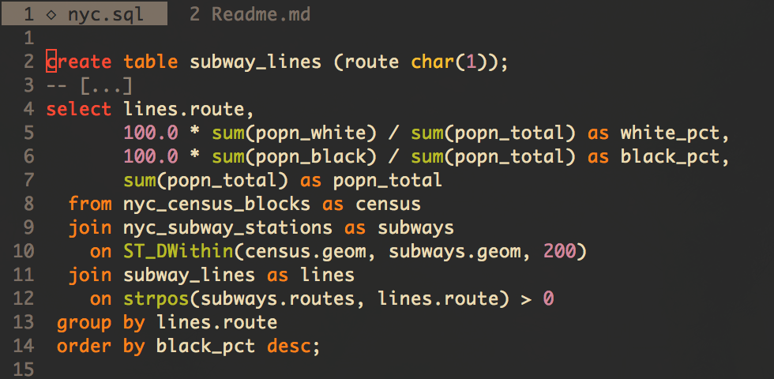
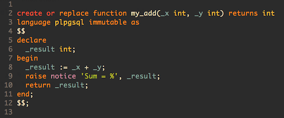
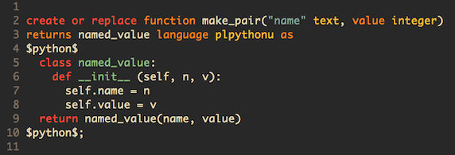

# Vim PostgreSQL syntax plugin



This plugin provides syntax highlighting and auto-completion support for
PostgreSQL version 9.4 or above and for some of its extensions:

- PL/pgSQL;
- PL/Python;
- [PostGIS](http://postgis.net) 2.2 (including PostGIS Topology);
- [pgTap](http://pgtap.org) 0.95.0.


# Installation

- Using [Vundle](https://github.com/gmarik/vundle), add to `.vimrc`:

        Plugin 'lifepillar/pgsql.vim'

- Using [Pathogen](https://github.com/tpope/vim-pathogen):

        cd ~/.vim/bundle
        git clone https://github.com/lifepillar/pgsql.vim.git


# Usage

Files with a `.pgsql` suffix are highlighted out of the box. If you want to
highlight `.sql` files using this plugin by default, add this to your `.vimrc`
(see `:h ft_sql.txt`):

    let g:sql_type_default = 'pgsql'

Alternatively, after loading a `.sql` file use this command:

    :SQLSetType pgsql.vim

To set the file type in new buffers use:

    :let b:sql_type_override='pgsql' | set ft=sql


# Autocompletion

This plugin just defines a new dialect for the standard SQL plugin included in
Vim. As such, it inherits the static and dynamic completion methods of Vim's
SQL (see `:h sql-completion`). So, for example, by default you may use
`<C-c>f` to complete function names, `<C-c>T` to complete types, and so on.
See `:h ft_sql.txt` for thorough documentation about SQL support in Vim.

In addition to the default mappings, I find it convenient to use `Tab` for
auto-completion. To do that, you may add the following snippet in
`.vim/after/ftplugin/sql.vim`:

```
fun! s:TabComplete()
  if pumvisible()
    return "\<c-n>"
  elseif col('.') > 1 && strpart(getline('.'), col('.') - 2, 3) =~ '^\w'
    call sqlcomplete#Map('syntax') " See :h sql-completion-static
    return "\<c-x>\<c-o>"
  else
    return "\<tab>"
  endif
endf

fun! s:ShiftTabComplete()
  return pumvisible() ? "\<c-p>" : "\<s-tab>"
endf

imap <silent><buffer> <tab>   <c-r>=<sid>TabComplete()<cr>
imap <silent><buffer> <s-tab> <c-r>=<sid>ShiftTabComplete()<cr>
```

As far as I know, [YouCompleteMe](https://github.com/Valloric/YouCompleteMe)
does not [support SQL](https://github.com/Valloric/YouCompleteMe/issues/573).
If you use YouCompleteMe you may want to disable it for SQL buffers. Add this
to `.vim/after/ftplugin/sql.vim`:

```
if exists('g:ycm_filetype_blacklist')
  call extend(g:ycm_filetype_blacklist, { 'sql': 1 })
endif
```


# PL/pgSQL Support

Code between `$pgsql$` or `$$` pairs is considered PL/pgSQL and highlighted
accordingly:



Names starting with an underscore are considered variables and highlighted as
such. It is recommended to adopt the convention of prefixing parameter and
local variable names with `_`.


# PL/Pythonu Support

Code between `$python$` pairs is highlighted as Python. For example:



# Customizing syntax coloring

This plugin defines the following highlight groups:

```
sqlComment
sqlConstant
sqlErrorCode
sqlExtension
sqlFunction
sqlIdentifier
sqlKeyword
sqlNumber
sqlOperator
sqlOption
sqlSpecial
sqlStatement
sqlString
sqlType
sqlTodo
sqlVariable
sqlPsqlKeyword
```

You may override a highlight group definition in your `vimrc`. For example:

```
hi! sqlKeyword  Keyword
```


# Bonus

Some useful [UltiSnips](https://github.com/SirVer/ultisnips) snippets.


# Acknowledgments

Original code from [space::tekk](https://github.com/spacetekk/pgsql.vim).

